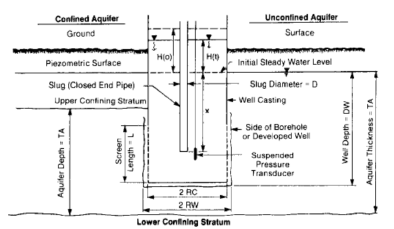

# Interpretation of Slug Test Data

## Overview

Pandit and Miner (1986) proposed a Translation Method for interpreting slug test data to reduce inconsistencies in estimating initial excess head, as commonly encountered in the Black (1978) method. This approach addresses subjectivity in matching field data to type curves, advocating for numerical methods to achieve more consistent hydraulic conductivity (\(K\)) estimation.

**Study Area:** Woodward-Clyde Consultants (WCC) test sites  
**Duration:** September 1984 – April 1986  
**Role:** Team lead  
**Status:** Completed

---

## Methods & Tools

**Data Sources**

- Slug test field measurements from WCC test wells (WCC No. 4, WCC No. 5, WCC-EW, WCC-LI)
- Cooper et al. (1967) type curve dataset used for validation

**Processing Steps**

1. Collected field voltage records using submersible pressure transducers and strip chart recorders, converting output to excess head H(t) via transducer calibration
2. Evaluated three methods for computing initial excess head H(0): theoretical computation, Regression Method, and the proposed Translation Method
3. Applied a least-squares numerical curve-matching procedure to replace subjective visual matching to type curves
4. Compared transmissivity (T) and hydraulic conductivity (K) estimates across all three H(0) methods
5. Developed and tested an interactive BASIC software package on a Hewlett-Packard 9845B personal computer for consistent, automated slug test analysis

**Tools Used**

| Tool | Purpose |
|------|---------|
| HP 9845B Personal Computer | Running the interactive BASIC software package |
| BASIC Programming Language | Implementing the numerical curve-matching and Translation Method |
| Submersible Pressure Transducers | Field data collection |
| Least-Squares Error Minimization | Objective type-curve matching |

---

## Key Findings

- The Translation Method produced transmissivity estimates in close agreement with the Regression Method (e.g., T = 1.4 vs 1.57 cm²/sec for WCC No. 4), confirming its accuracy
- Automating slug test analysis via numerical curve-matching reduced analysis time by up to 50% compared to manual methods
- The Translation Method is more direct and consistent than existing methods, minimizing subjective judgment in H(0) estimation
- Reliable results require the steady response curve to begin within 10% of the time needed to dissipate 80% of the initial excess head
- Storage coefficients implied by type-curve matching showed order-of-magnitude variation across data sets and should not be used alone to identify confined vs. unconfined conditions

---

## Links

[View Published Paper](https://ngwa.onlinelibrary.wiley.com/doi/abs/10.1111/j.1745-6584.1986.tb01690.x){ .md-button }

